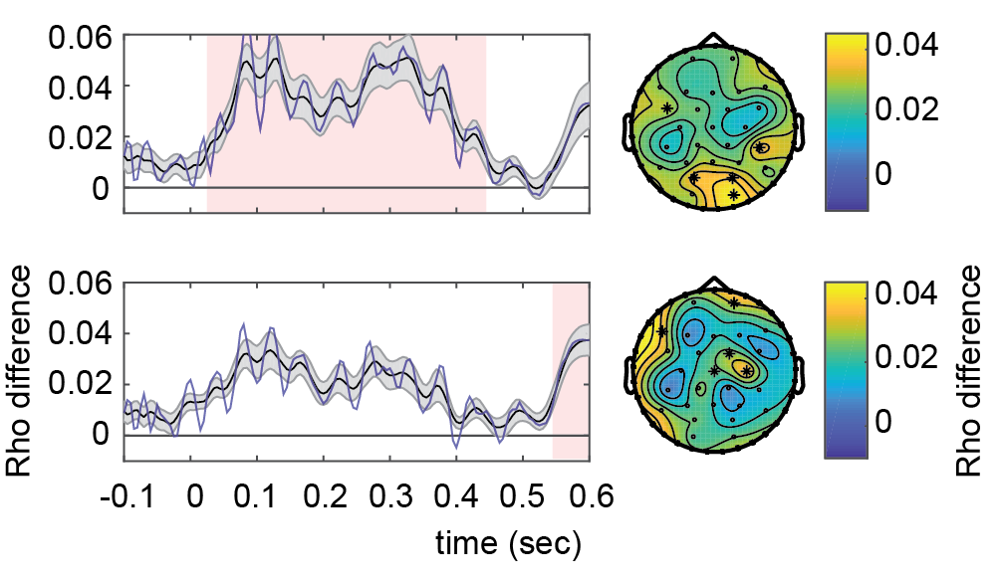

# Phase Discrimination

This repository contains the code belonging the the paper _"Phase-coded oscillatory ordering promotes the separation of closely matched representations to optimize perceptual discrimination (2020). Ten Oever, Meierdierks, De Graaf, Duecker, & Sack"._

## Figures and corresponding scripts
### Figure 2
[S01_00_BehavioralAnalysis](./S01_00_BehavioralAnalysis.m): Psychometric curves

### Figure 3
[S02_00_EEGCircGLM](S02_00_EEGCircGLM.m): Circular correlation between phase and response
[S03_00_EEGCircGLM_followup](S03_00_EEGCircGLM_followup.m): Follow up analyses on the main circular correlation Figure

### Figure 5
[S04_00_TRF](./S04_00_TRF.m): Temporal Response Function correlation with ongoing phase

### Figure 6
[S04_00_TRF](./S04_00_TRF.m): Temporal Response Function correlation with ongoing phase

### Figure 7
[S05_00_PhaseComp](./S05_00_PhaseComp.m): Compares the behavioral phase and TRF phase
[S06_00_EEGCirc_overallCorr](./S06_00_EEGCirc_overallCorr): correlation between behavioral phase effect and overall correlation

### Notes
- All data can be found here: <LINK>
- Information regarding the data structures is in the attached [Info.txt](./Info.txt) file