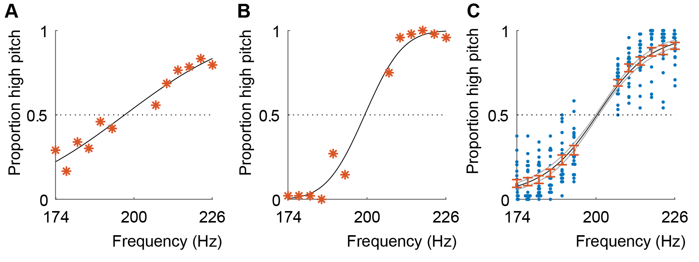
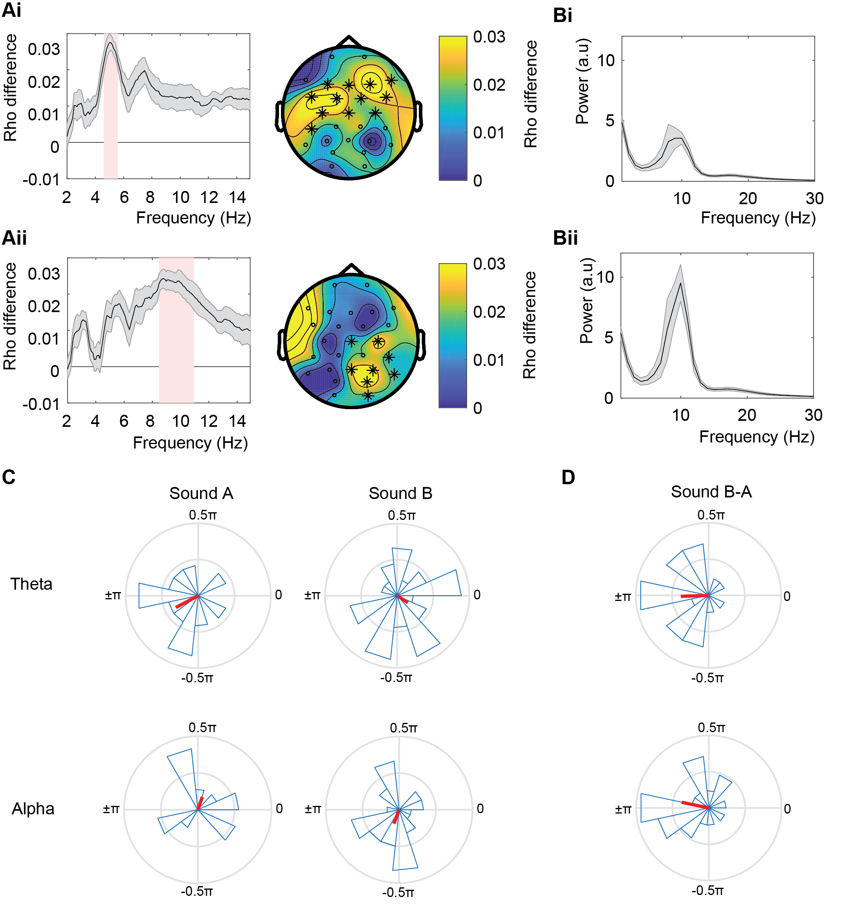
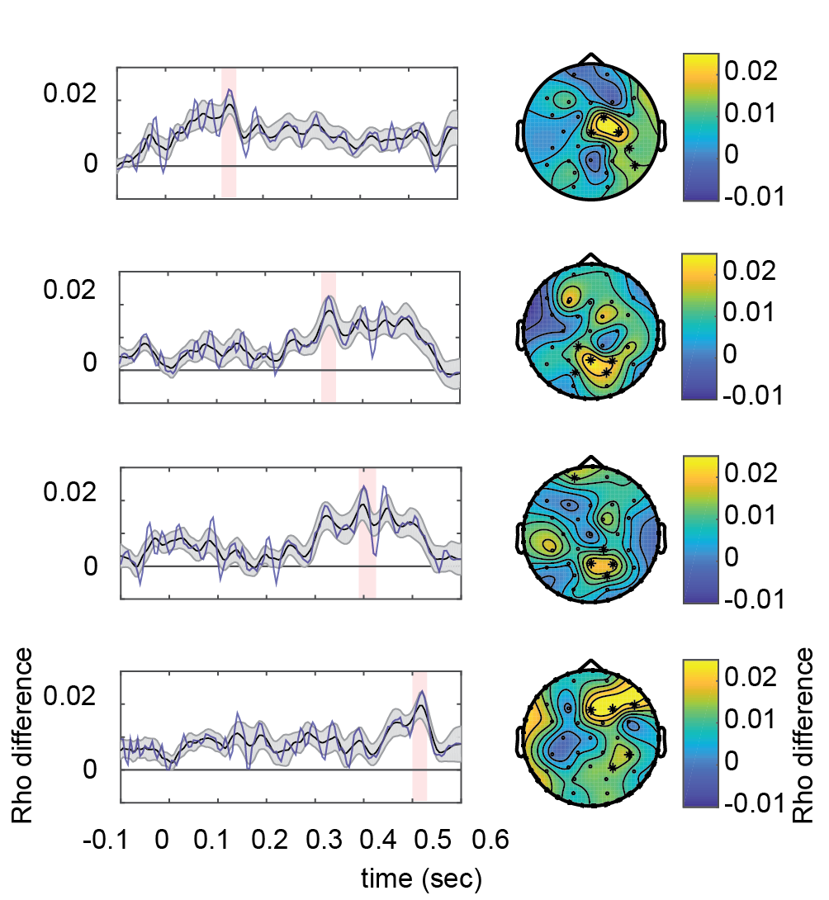

# Phase Discrimination

This repository contains the code belonging the the paper _"Phase-coded oscillatory ordering promotes the separation of closely matched representations to optimize perceptual discrimination (2020), Ten Oever, Meierdierks, De Graaf, Duecker, & Sack"._

## Figures and corresponding scripts
# Figure 2
S01_00_BehavioralAnalysis: Psychometric curves

# Figure 3
S02_00_EEGCircGLM: Circular correlation between phase and response
S03_00_EEGCircGLM_followup: Follow up analyses on the main circular correlation Figure

# Figure 5
S04_00: Temporal Response Function correlation with ongoing phase

# Figure 6
S04_00: Temporal Response Function correlation with ongoing phase

# Figure 7
S05_00_PhaseComp: Compares the behavioral phase and TRF phase
S06_00_EEGCirc_overallCorr: correlation between behavioral phase effect and overall correlation

# Notes
- All data can be found here: <LINK>
- Information regarding the data structures is in the attached Info.txt file